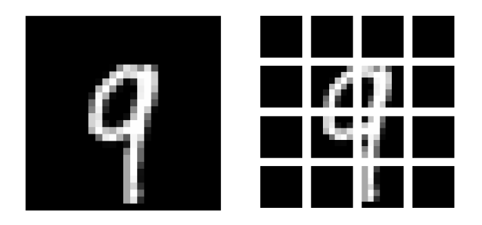
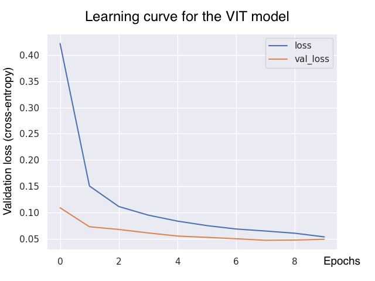

# vision-transformer
Tensorflow implementation of Image Classification with Vision Transformer on the MNIST dataset.


## Instructions

1. Using an environment with `python 3.10.8`, install modules using:

   ```bash
   pip install -r requirements.txt
   ```

2. To train and evaluate the VIT model, run:

   ```bash
   python train_VIT.py
   ```

3. To train and evaluate the CNN model (benchmark model), run:

   ```bash
   python train_CNN.py
   ```

4. To generate the figures from the report, run:

   ```bash
   python experiments/impact_of_ds_size.py
   ```


### The Vision Transformer (VIT) architecture

Note that our VIT architecture is following the one from *An Image is Worth 16x16 Words: Transformers for Image Recognition at Scale, Dosovitskiy, 2021*. I also used some lines of codes from the [Keras website](https://keras.io/examples/vision/image_classification_with_vision_transformer/).


<p align = "center"> <b>Fig.1: Integration of the Vision Transformer for a CV classification problem</b></p>


#### Why Transformer matters

First thing first, we might legitimately wonder: why bother implementing Transformer for Computer Vision? Indeed, it has been proved that a MultiLayer Perceptron (MLP) can model any function if it is deep enough (cf the universal approximation theorem). The reason is that Transformers are even more "generic" than MLPs in the sense where the weights are computed on-the-fly. Hence, we can expect a model with Transformers to better generalize to unseen data.


#### Why is it non-trivial to implement the Transformer for Computer Vision problems?

For a reasonable image size $N \times M$ (e.g. $32 \times 32$ for the `cifar` dataset), we would have a significant number of pixels $NM$. The naive Transformer solution is to unroll the image into a $NM$-vector and then to compute the pairwise attention with all of its inputs. Hence there are $(NM)^2$ operations to compute: this is of course non-tractable.


#### Patching the image with the VIT Paper

The main idea to tackle the previous complexity issue is to split the image into patches. Therefore, we will limit the number of pairwise attention.

```
Image size: 28 X 28
Patch size: 7 X 7
Patches per image: 16
Elements per patch: 49
```




<p align = "center"> <b>Fig.2: Result of image patching for an arbitrary example in the MNIST dataset</b></p>


#### Some technical notes

- The VIT concatenates a positional embedding obtained from the patch position to each raw patch embedding
- The VIT also adds an extra learned embedding input in front of the sequence of patches. The output associated to this extra embedding will be the output of the VIT. The reason we need this extra step is that there is no reason to foster any image patch. Note that this extra embedding is similar to BERT's `[class]` token (*BERT: Pre-training of Deep Bidirectional Transformers for Language Understanding, Devlin et al., 2018*)


### Implementation and results

#### Model summary

The following `config.yaml` file contains the values of the hyperparameters used for the VIT model in this report:

```yaml
num_classes: 10
input_shape: [28, 28, 1]
learning_rate: 1e-4
weight_decay: 0.0001
batch_size: 64
num_epochs: 10
image_size: 28  # We'll resize input images to this size
patch_size: 7  # Size of the patches to be extract from the input images
projection_dim: 256
dropout: 0.2
num_heads: 8
transformer_units: [
    512,
    256,
]  # Size of the transformer layers
n_transformer_layers: 3
mlp_head_units: [256]  # Size of the dense layers of the final classifier

```


Note that this config gives a model with these numbers of parameters:

```
Total params: 8,171,274
Trainable params: 8,171,274
Non-trainable params: 0
```


#### Preliminary notes


<p align = "center"> <b>Fig.3: Class distribution for both train and test sets</b></p>

Note that since there is no significant class imbalance, we will use the accuracy as our main metric.


#### Performance



<p align = "center"> <b>Fig.4: Learning curve for the VIT model</b></p>


### Comparison with Convolution Neural Networks (CNNs)

#### Choice of the CNN architecture

```
Model: "sequential"
_________________________________________________________________
 Layer (type)                Output Shape              Param #
=================================================================
 data_augmentation (Sequenti  (None, 28, 28, 1)        0
 al)

 conv2d (Conv2D)             (None, 28, 28, 32)        832

 conv2d_1 (Conv2D)           (None, 28, 28, 32)        25632

 max_pooling2d (MaxPooling2D  (None, 14, 14, 32)       0
 )

 dropout (Dropout)           (None, 14, 14, 32)        0

 conv2d_2 (Conv2D)           (None, 14, 14, 64)        18496

 conv2d_3 (Conv2D)           (None, 14, 14, 64)        36928

 max_pooling2d_1 (MaxPooling  (None, 7, 7, 64)         0
 2D)

 dropout_1 (Dropout)         (None, 7, 7, 64)          0

 flatten (Flatten)           (None, 3136)              0

 dense (Dense)               (None, 128)               401536

 dropout_2 (Dropout)         (None, 128)               0

 dense_1 (Dense)             (None, 10)                1290

=================================================================
Total params: 484,714
Trainable params: 484,714
Non-trainable params: 0
```


Now let's highlight a few pros and cons for the Vision Transformer architecture.


#### (i) The VIT performs better than CNNs with large datasets

Due to lack of strong computational power for training the VIT on large datasets, we will use the results from the *An Image is Worth 16x16 Words: Transformers for Image Recognition at Scale* paper. Note that all training sets that are used for the following comparison are very large datasets.


<p align = "center"> <b>Fig.5: Comparison with state of the art on popular image classification benchmarks</b></p>


**Observation:**

- The VIT model matches or exceeds the state of the art on many image classification datasets


#### (ii) The VIT lacks some inductive biases for small datasets


<p align = "center"> <b>Fig.5: Comparison of learning for the CNN and the VIT models</b></p>


Note that for MNIST which is our dataset at hand, we have a total of 60000 examples in our training set. In the next section, we will see that the number of available examples play a significant role in the VIT performance.

For this experiment, we have trained both VIT and CNN models with only a small fraction of the MNIST dataset.

Note that the test set is invariant between the 2 experiments and has a size of 10,000 unseen examples.


<p align = "center"> <b>Fig.6: Comparison of learning for the CNN and the VIT models for small training sets</b></p>


**Observations:**

1. The bigger the training set, the better performance both the VIT and CNN models achieve after each epoch
2. For all the small training set sizes at hand, the CNN model performs better than the VIT.

**Interpretation:**

1. This behavior was expected as if the model doesn't overfit (which is the case as we only considered 5 epochs here), the validation loss is a decreasing function with respect to the number of epochs

2. This observation goes hand-to-hand with this quote from the VIT paper:

   > When trained on mid-sized datasets such as ImageNet without strong regularization, these models yield modest accuracies of a few percentage points below ResNets of comparable size. This seemingly discouraging outcome may be expected: Transformers lack some of the inductive biases inherent to CNNs, such as translation equivariance and locality, and therefore do not generalize well when trained on insufficient amounts of data.

   Let's explain what the author means by lack of *inductive biases*. As a reminder, the reason why CNNs are preferred over Fully-Connected Dense layers is that they have much less parameters as they take the image spatial structure into consideration. For instance, a CNN is translation invariant but this is not the case for the VIT *a priori*: the VIT must learn this by itself, hence the bigger dataset needed for training. 


#### (iii) The VIT is in general more computational-heavy

Note that both experiments were realized on the same machine (MacBook Pro M1, 16 GB of RAM).

|                                      | VIT       | CNN     |
| ------------------------------------ | --------- | ------- |
| Total number of parameters           | 8,171,274 | 484,714 |
| Average computation time for 1 epoch | 57'30"    | 51'30"  |

**Observations:**

- Our VIT model has almost 20 times more parameters than our CNN
- The computational time is almost 10% longer for the VIT compared to the CNN model

**Interpretation:**

- The high computation time for VIT is a direct consequence of the model's high number of parameters. We can easily extrapolate that training a VIT with much more parameters and a much more complicated dataset will take even more time to train compared to a simple CNN
- The high number of parameters can also pose a problem to load the model on machines with limited memory (e.g. on smartphones).


## Acknowledgments

Note that our VIT architecture is the same one as the one presented in *An Image is Worth 16x16 Words: Transformers for Image Recognition at Scale, Dosovitskiy, 2021*. Some lines of codes were taken from the [Keras tutorial on "Image classification with Vision Transformer"](https://keras.io/examples/vision/image_classification_with_vision_transformer/).
